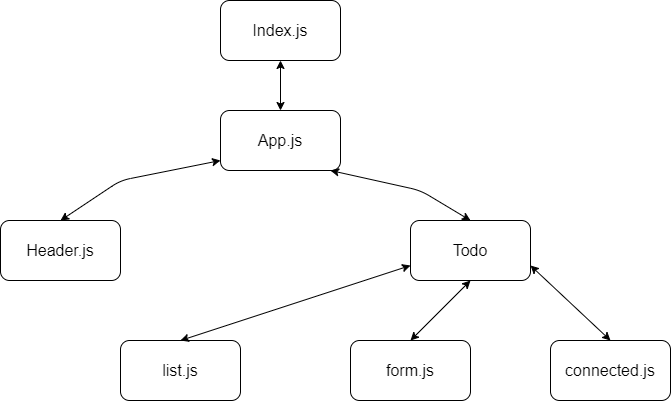
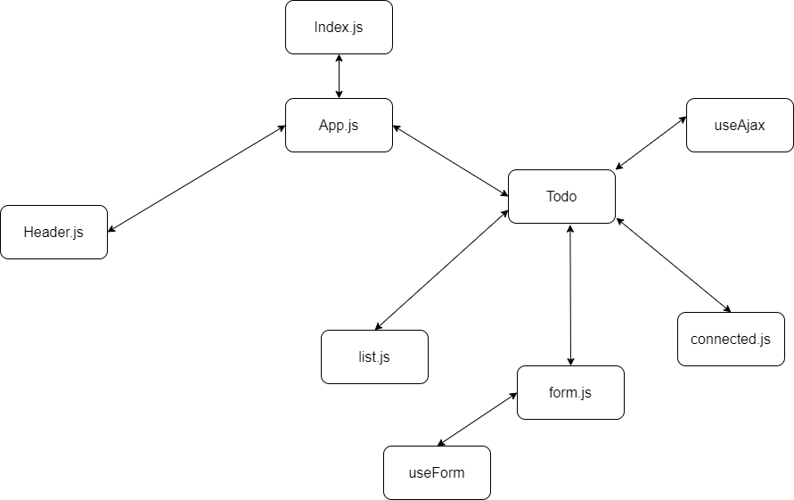
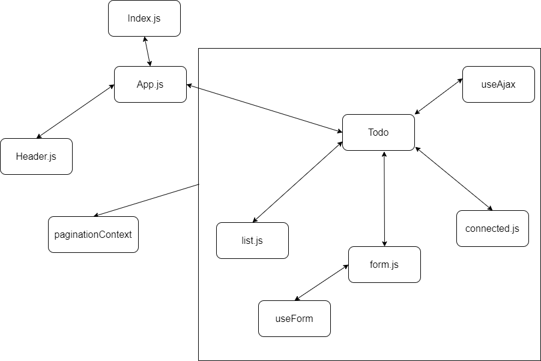
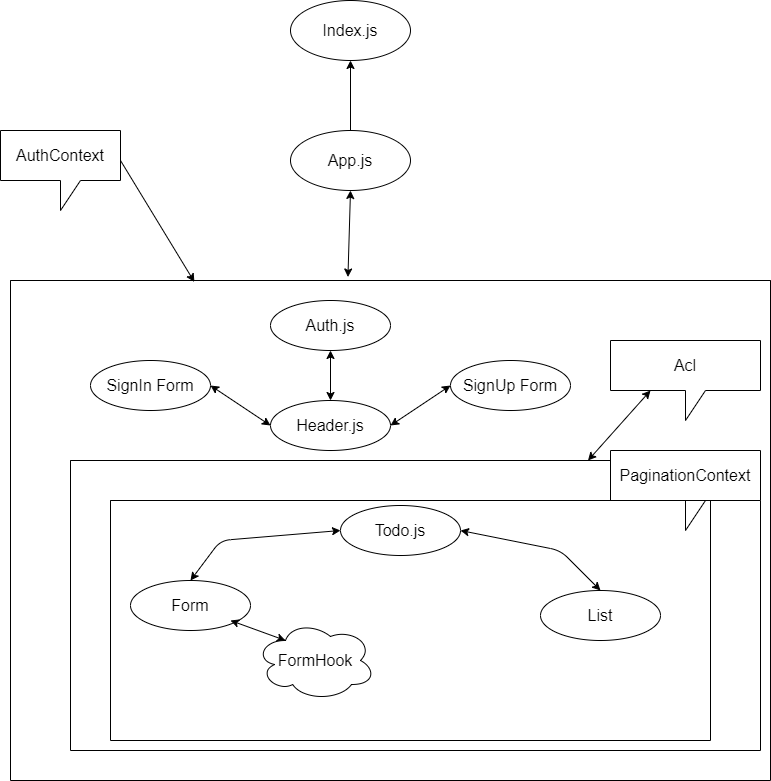

# TO-DO App
## This project was bootstrapped with Create React App.

## Available Scripts

In the project directory, you can run:
    npm start

Runs the app in the development mode.
Open http://localhost:3000 to view it in the browser.

# Links 

[Repo Link](https://github.com/yasmeenokh/todo)

[Pull ReQuests](https://github.com/yasmeenokh/todo/pulls)

[Deployed Link](https://fervent-swirles-0687e3.netlify.app/)

# White Board: 

### Lab 32

### Lab 33

### Lab 34

